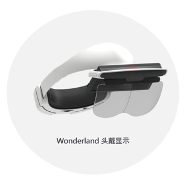
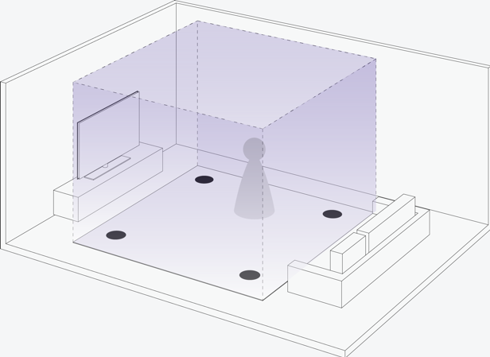
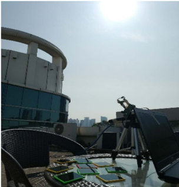
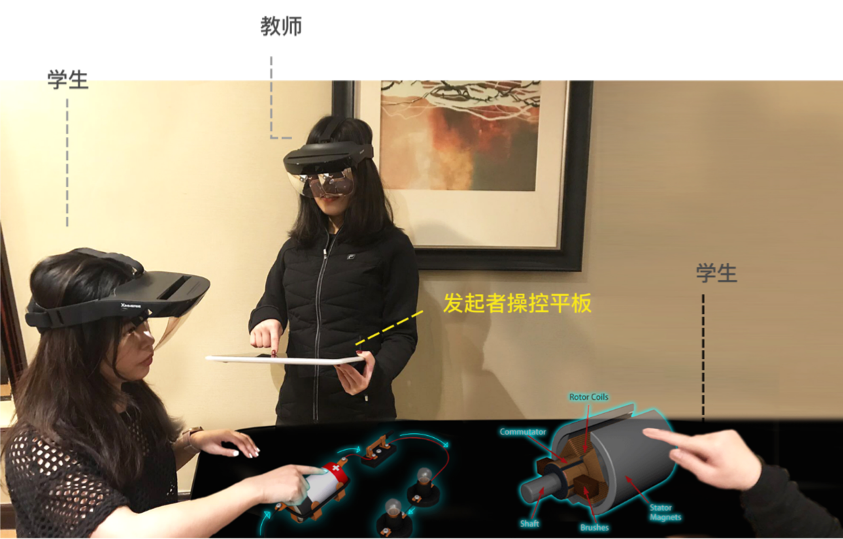

# 系统介绍

> Wonderland系统是一套三维立体应用交互系统，包括头戴显示设备和可自定义交互设备。
>
> 
> 

**图1. 头戴显示器和交互设备示例**

> Wonderland头戴显示设备，基于**反射自由曲面光学**设计，可更换式的**强磁吸镜片**，自主研发的**反畸变算法**，全透视双目立体显示，实时同步的运动显示，异步时间的扭曲算法，提供**低延时**、**高稳定**、**高清晰**、**大视场**的显示效果。

**图2. 大视场显示示例**

> Wonderland的交互设备通过**高通835的SLAM**提供头部6DoF跟踪和**自主研发的x-Tag交互系统**实现灵活World
> Anchor式的虚实空间定位、任意组合式的组件操控交互、同步式多人互动协作。
>
> 

**图3. World Anchor虚实实间定位示例**

> 
>
> **图4. 组合式组件操控示例**
>
> 
>
> **图5.同步式多人互动协作示例**
>
> Wonderland的x-Tag交互系统，通过一套基于单目和Marker的6DoF跟踪系统，实现高抗干扰、高识别率、低成本、易维护、高可用、易携带的灵活输入跟踪。不同形状的Marker，可以用在不同的特殊场景。
>
> 
> 
> 

**图6. 稳定跟踪示例**

**图7. 较便易携带示例**

> Wonderland
> AR系统为医疗、教育、实训、娱乐等垂直行业，提供稳定、高效、互动的行来解决方案，以提升行业效率。

**图8. 医疗行业应用示例**

**图9. 教育行业应用示例**

**图9. 实训行业应用示例**

**图10. 娱乐行业应用示例**
