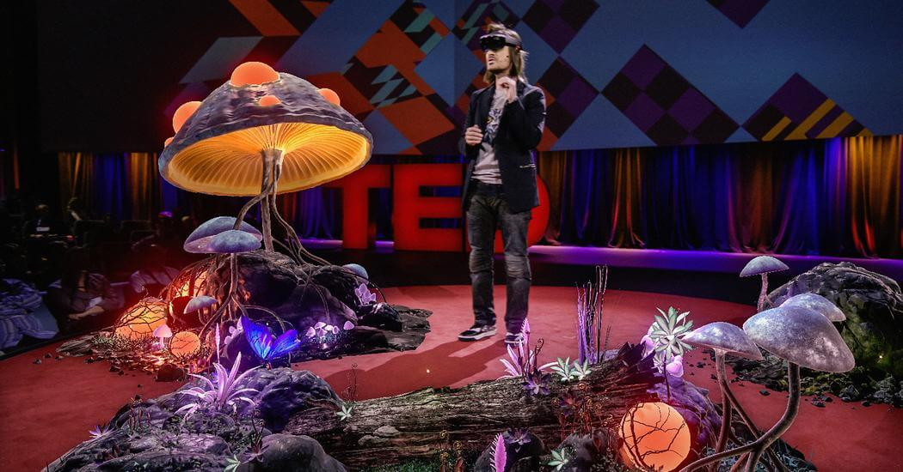
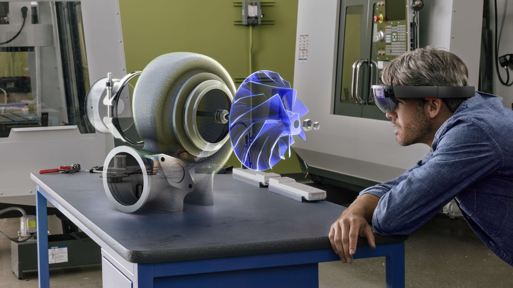

# Illusion

If VR strives for presence, MR strives for existence. We need to try everything to trick the viewer into believing the illusion that the virtual objects actually **exist** in the space around them.

## Provide cues to make virtual objects feel grounded
Making virtual objects feel grounded is no easy task in optical see through AR since it cannot render dark shadow directly. Shadow is an important grounding cue and we need to use other techniques to accommodate its absense.

<table class="DoDont_table" cellspacing="100">
  <tr>
    <th><video width="100%" autoplay loop muted  src="videos/Hologram_football.mp4"></video></th>
    <th class="divider"></th>
    <th><video width="100%" autoplay loop muted  src="videos/dinosaur_shadow.mp4"></th>
  </tr>
  <tr class="DoDont_tr">
    <td class="Do_td">Do</td>
    <td class="divider"></td>
    <td class="Do_td">Do</t>
  </tr>
  <tr class="content">
    <td>Use plannar reflection to create strong grounding cues on reflective surfaces.</td>
    <td class="divider"></td>
    <td>Create shadow by adding light.</t>
  </tr>
</table>
<table class="DoDont_table" cellspacing="100">
  <tr>
    <th></th>
    <th class="divider"></th>
    <th></th>
  </tr>
  <tr class="DoDont_tr">
    <td class="Do_td">Do</td>
    <td class="divider"></td>
    <td class="Do_td">Do</td>
  </tr>
  <tr class="content">
    <td>Create something that interacts with the ground, like physics driven particles and objects. [Image: <a target="_blank" href="https://www.magicleap.com/news/partner-stories/weta-launches-rocket-game-on-magic-leap-world">Magic Leap</a>]</td>
    <td class="divider"></td>
    <td>Add fx to character's feet, or wheels. [Image: <a target="_blank" href="https://developer.magicleap.com/learn/guides/magickit-drive-design-diary">Magic Leap</a>]</t>
  </tr>
</table>
<table class="DoDont_table" cellspacing="100">
  <tr>
    <th></th>
    <th class="divider"></th>
    <th></th>
  </tr>
  <tr class="DoDont_tr">
    <td class="Do_td">Do</td>
    <td class="divider"></td>
    <td class=""></td>
  </tr>
  <tr class="content">
    <td>Use additive cues, like ground grid overlay, circle UI and ripples. [Image: <a target="_blank" href="https://designguidelines.withgoogle.com/ar-design/content/content-manipulation.html#content-manipulation-translation">Google</a>]</td>
    <td class="divider"></td>
    <td></td>
  </tr>
</table>

## Avoid filling the field of view with content
What's seperate MR from VR is that user's real environment can be seen. Content needs to be designed to accomdate this, instead of copying VR.

<table class="DoDont_table" cellspacing="100">
  <tr class="DoDont_tr">
    <td class="Dont_td">Don't</td>
    <td class="divider"></td>
    <td class="Dont_td">Don't</td>
  </tr>
  <tr class="content">
    <td>Don't create a large landscape surrounding the user. The landscape won't feel grounded and would introduce motion sickness more easily.</td>
    <td class="divider"></td>
    <td>Don't place something that won't fit in a room, like something too big or too far away. It would appear clipping in fov or not grounded.</td>
  </tr>
</table>
<table class="DoDont_table" cellspacing="100">
  <tr>
    <th></th>
    <th class="divider"></th>
    <th></th>
  </tr>
  <tr class="DoDont_tr">
    <td class="Do_td">Do</td>
    <td class="divider"></td>
    <td class=""></td>
  </tr>
  <tr class="content">
    <td>Create an 'island' which would fit in a room to cue the atomsphere. [Image: <a href="https://www.ted.com/talks/alex_kipman_a_futuristic_vision_of_the_age_of_holograms" target="_blank">Microsoft</a>]</td>
    <td class="divider"></td>
    <td></td>
  </tr>
</table>

## Avoid dark color appearing in the view.
Dark color won't be seen through an optical-see-through headset. According to tests, any color which the brightness is below 0.5 without surranding bright color would appear transparent in normal indoor lighting conditions.

<table class="DoDont_table" cellspacing="100">
  <tr class="DoDont_tr">
    <td class="Do_td">Do</td>
    <td class="divider"></td>
    <td class="Do_td">Do</td>
  </tr>
  <tr class="content">
    <td>Choose color whose brightness is above 50% when preparing assets.</td>
    <td class="divider"></td>
    <td>Use unlit shader or baked GI to achieve a look with no hard shadows.</t>
  </tr>
</table>
<table class="DoDont_table" cellspacing="100">
  <tr>
    <th></th>
    <th class="divider"></th>
    <th></th>
  </tr>
  <tr class="DoDont_tr">
    <td class="Do_td">Do</td>
    <td class="divider">
  </tr>
  <tr class="content">
    <td>Use rim light shader to render dark objects.</td>
    <td class="divider"></td>
    <td></t>
  </tr>
</table>

## Strive for a clean look with no aliasing.
Aliasing downgrade the visual quality greatly. The pixel density of RhinoX is not very high compared to desktop which would amplify the aliasing effect.

<table class="DoDont_table" cellspacing="100">
  
  <tr class="DoDont_tr">
    <td class="Rec_td">Recommend</td>
    <td class="divider"></td>
    <td class="Dont_td">Don't</td>
  </tr>
  <tr class="content">
    <td>Use anti-aliasing level 4x or above.</td>
    <td class="divider"></td>
    <td>Don't use too detailed texture, since detail would appear aliasing.</t>
  </tr>
</table>
<table class="DoDont_table" cellspacing="100">
  
  <tr class="DoDont_tr">
    <td class="Dont_td">Don't</td>
    <td class="divider"></td>
    <td class=""></td>
  </tr>
  <tr class="content">
    <td>Don't use lines thinner than 3 dmm. According to tests, they would appear 'blinking'.</td>
    <td class="divider"></td>
    <td></td>
  </tr>
</table>

<!-- ## Avoid precise alignment between virtual and real objects, like controllers

Exact alignment btween virtual and real wouldn't work very well since the tracking and optics are not accurate enough in this generation.

<table class="DoDont_table" cellspacing="100">
  <tr>
    <th></th>
    <th class="divider"></th>
    <th></th>
  </tr>
  <tr class="DoDont_tr">
    <td class="Dont_td">Don't</td>
    <td class="divider"></td>
    <td class="Do_td">Do</t>
  </tr>
  <tr class="content">
    <td>Don't make a virtual object with the exact same size and shape with the real object. </td>
    <td class="divider"></td>
    <td>Make the position and shape of a virtual object unrelated to the real object.</t>
  </tr>
</table> -->

## Objects should enter the scene with a belivable setting

In real world, objects don't just appear into the world all of a sudden. Introduce your characters into the scene through a portal, a hologram projector or other creative ways. A good first impression would be carried along through the entire experience.

<!-- Begin Mailchimp Signup Form -->
<link href="//cdn-images.mailchimp.com/embedcode/horizontal-slim-10_7.css" rel="stylesheet" type="text/css">

<form action="https://github.us4.list-manage.com/subscribe/post?u=98e146615feaa80a87c9e26a2&amp;id=29c6a9379d" method="post" id="mc-embedded-subscribe-form" name="mc-embedded-subscribe-form" class="validate" target="_blank" novalidate>
    

  <label for="mce-EMAIL">This page is under constant improvement. 👋 Subscribe to future updates! </label>
  <input type="email" value="" name="EMAIL" class="email" id="mce-EMAIL" placeholder="email address" required>
    <!-- real people should not fill this in and expect good things - do not remove this or risk form bot signups-->
    
<input type="text" name="b_98e146615feaa80a87c9e26a2_29c6a9379d" tabindex="-1" value="">

    
<input type="submit" value="OK⏎" name="subscribe" id="mc-embedded-subscribe" class="button">

    

</form>

<!--End mc_embed_signup-->
