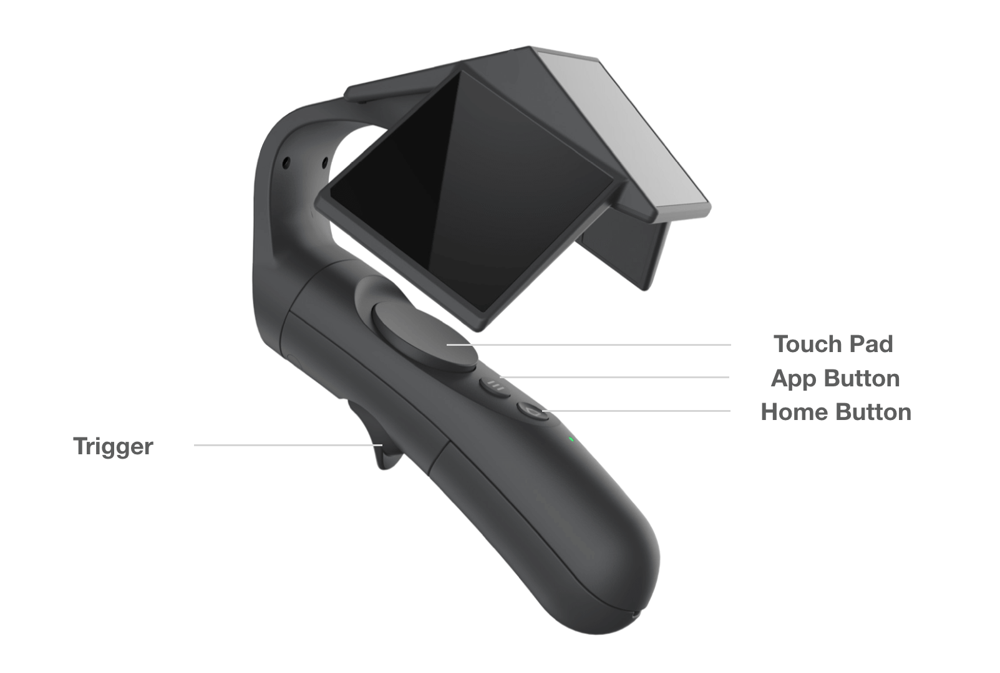

# Interaction

## Principles

### Input modality defines interaction
Different input modalities create different constraints and opportunities for interaction design. Currently, there are head gaze, 3 DoF(Degree of freedom) controller, 6 DoF controller, hand tracking, voice recognition, object tracking (Like X-tag for Rhino X) and more input modalities for MR. We believe that these modalities would find their own unique application area in the future.

### Perceived affordance and signifier
[Perceived affordance and signifier](https://ux.stackexchange.com/a/94270) are terms brought to design by Donald Norman. MR is a simulated virtual world and people would bring their knowledge of real world with them. They would expect the virtual object to behave like the real one.

Most of the time, we want to choose objects with fewer **perceived affordances**. It not only helps to guide the user towards the action we intended, but also decrease the number of features we have to develop to fulfill user's expectations. For example, in the image below, users would expect the hammer on the left to be able to pull out nails besides hammer nails.

Lots of VR games use console cartridge to load a game level, not only because it symbolizes loading a game, but also cartridge only "affords" being put into a tray for most people.

**Signifiers** are traces of an object that communicate the intended use to the user. When designing a novel 3D widget, we need to design the signifiers to guide the right direction. A lot of signifiers found in everyday objects are the **intrinsic characteristics** of objects. For instance, different sizes of button would signify different affordances. People turn to **point** a small button with index finder and **push** a large button with full palm.

Such signifiers can sometimes be too subtle so it's okay (sometimes necessary) to use some tips like text, voice-over and animations to help users out. These are also categorized as signifier.
### Continuous and multi-sensory feedback
When users correctly perceive designers' intent, they would try to approach it. Not only we should provide feedbacks for users' final action, but also for users' approaching action. This is why your mouse cursor turns into a hand when hovering a clickable link. With this feedback, we would know **whether a link is "clickable"** and **our cursor is within the effective range of the link** before pressing down mouse button.
Feedbacks are especially needed for **uncertain** actions. Hand tracking or controller tracking do not work 100% of the time, so more feedbacks are needed for the status of tracking.

Use audio, vibration and particles to accommodate the absence of true haptic feedbacks. For games, these feedbacks are more sensational than functional.

### Onboarding
Most of MR users are first-time users and an proper onboarding experience is needed. Many of them actually don't know that they can move around in MR. Getting to know the button mapping of controllers proved to be challenging as well, especially for non-gaming users.
That's why we created a tested `UniversalOnboarding.unitypackage` which can be embeded into your experience to ensure a smooth yet not too long onboarding experience.

### Continuous POI(Point of interest) flow
In traditional games, we can control where the users are looking at by controlling the camera. However, we have lost this ability and users can be looking wherever they want.

It's very easy to design a narrative or a game play that introduces a sudden change of POI, like the opponents suddenly appear from another side of the room or requiring users to look for a specific item in the room. Users would simply lose track of the POI and struggle to find them again.

To avoid this, designers need to make sure that there is only one POI in the view and POI only move continuously. When this flow has to be interrupted(e.g. loading a game scene), try to bring the new POI to the front  or guide their attention with directional indicators. Traces like spatial audio and particle effects would make it easier for users to find the POI again.

## One handed controller best practices

The Current controller for Rhino X is a one handed 6DoF controller with Daydream style button mapping. The positional tracking is achieved with Ximmerse's proprietary marker tracking technology.

### Technology limitations
The controller cannot be tracked when markers are occluded. We will fall back to 3 DoF IMU tracking and use `arm model` to predict the position of the controller.
We also tilt the ray-cast by some degrees so that the controller is in an optimal position for tracking when performing ray-casting.
<!-- ### Grab
Grabbing is a fundamental interaction in MR. Feedbacks for hovering, grabbing can be easily added with our `InteractionToolkit.unitypackage`.
For far field interaction, we came up with several novel interaction techniques which you can try out.
#### Far field grabbing techniques : Zoom Grab and Portal Grab
[zoom grab]
[distance hover grab] -->
<!-- ### Onboarding -->

## X-tag possibilities
Due to the flexible marker tracking, pretty much anything can be brought into MR with X-tag.
This could unlock an uncharted territory where interactions in MR can become truly tangible. Stay tuned on this one.
<!--
### Technology limitations
### Case study: MR Kitchen Kit
-->
