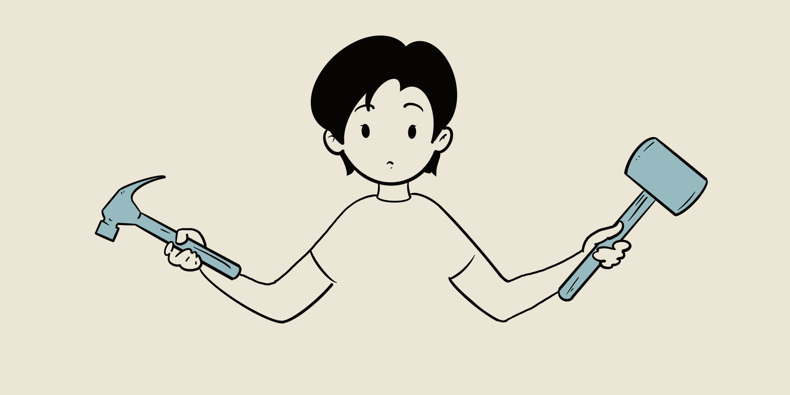
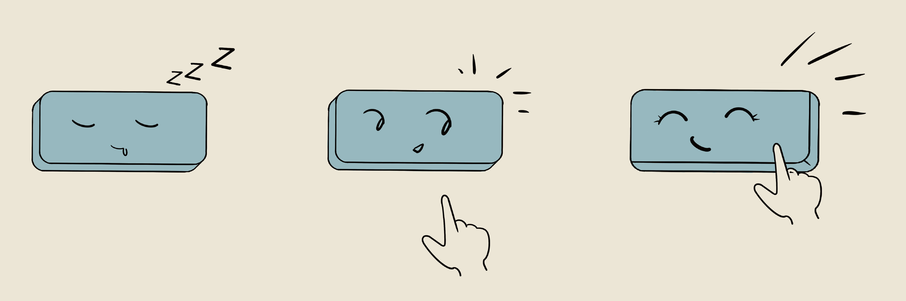

# 交互

## 原则篇

### 输入模态决定交互
不同的输入模态会为交互设计带来不同的限制和机会。目前，MR界已经有了包括头瞄、三自由度手柄、六自由度手柄、手势跟踪、语音识别、物体识别（如Rhino X的X-tag技术）等输入模态。这些输入模态各有千秋，我们相信它们在未来都会有一席之地，有自己独特的应用场景。

### 预设用途和指示符
预设用途（[Perceived affordance](https://www.zhihu.com/question/19608055/answer/13492182)，直译为被感知到的可供性）和指示符（[Signifie](https://www.zhihu.com/question/19965677/answer/106097258)，也被译为能指）都是被唐纳德诺曼带入设计界的学术名词。
这两个名词在设计界存在诸多[讨论](https://ux.stackexchange.com/a/94270)，也经常被滥用。但在MR领域的交互设计中，预设用途和指示符能带来很好的思考问题的角度。我们强烈建议你通过上面的链接将这些名词区分清楚。

因为MR是一个虚拟的“现实世界”，当人们在MR中看到一个平时见过的日常物体时，人们自然会将日常生活的经验带入其中。因此他们会期望虚拟物体和真实物体的行为一致。而用户在MR里的输入行为比PC和移动端自由得多，人们不仅对交互可能性有更高的预期，他们还会真地尝试去做。如果我们满足了人们的预期，他们会欢呼（比如在《半衰期：艾利克斯》的窗户上画画，或是在《工作模拟器》里复印脑子），反之就会觉得挫败。
大部分时候，我们希望物体的**预设用途**越少越好。这不仅能引导用户使用我们期望的功能，而且能减少我们需要开发的功能点。举个例子，在下图中，如果采用左侧的锤子，用户对其的预期是既能锤钉子，又能拔钉子；而如果采用右侧的锤子，则用户的预期就只剩下了锤钉子。

许多VR游戏都会用任天堂主机那样将卡带插入卡槽的方式来加载一个游戏关卡，这不仅仅是因为这个动作代表加载一个游戏，也是因为卡带除了被放进卡槽外没有别的用途，因此用户不需要学习就会使用。

**指示符** 是物体包含的能将预设用途传递给用户的特征。当设计一个全新的三维组件时，我们需要设计好指示符来指引用户。很多时候，物体的**固有特征**就能作为指示符。例如，按钮的大小就会指示不同的操作方式。面对一个小巧的按钮，人们下意识会选择用食指按；而面对一个大的按钮，人们下意识会用手掌去推。

不过这类指示符有时会过于细微，因此加入一些直接的指引，如文字、语音、动画来引导用户也未尝不可。这些指引也被归类为**指示符**。

### 反馈应连续，且充分利用多个感官
当用户正确地理解设计师的意图时，他们就会尝试去与其交互。这时候我们不仅要为用户的最终操作提供反馈，也要为用户**尝试**的这一操作提供反馈。这就是为什么当你的鼠标指针移动到一个可以点击的按钮上时，鼠标指针会变成一个手掌的形状。这个反馈就让我们知道这个按钮是**可被点击**的且**指针已经进入按钮的可点击区域**。
反馈对于**不确定**的操作尤为重要。手势跟踪和控制器跟踪不是100%都正常工作，因此我们也要为跟踪的状态提供反馈。否则用户在跟踪不到的时候还尝试进行操作，而这个操作又没有被系统捕捉，用户就会觉得很困惑，觉得设备不灵敏。

在MR和VR中，真实的触觉反馈是缺失的，因此我们需要提供更多的如声音、振动、粒子特效等反馈来补偿。对于游戏来说，这些反馈除了在功能上有用，更重要的是能提供更佳的手感或爽快感。

### 用户引导
大部分MR用户都是首次尝试该技术，这时候一个良好的用户引导就非常重要了。据我们观察，很多新用户一开始都不知道他们能在MR中自由移动。而学习控制器按钮的按键位置对于非游戏玩家则尤为艰难。
我们正在制作一个经过测试的 `UniversalOnboarding.unitypackage` 。将其加入你的应用中，你就能确保用户能顺畅地学会基本操作并开始体验。

### 连续的兴趣点（Point of interest）流动
在传统3D游戏中，我们可以控制用户的相机来控制用户注视的方位。在MR中，我们失去了这一控制。用户可以看向任意他们想看的方向。

在设计故事或游戏玩法时，我们非常容易让兴趣点突然转换，比如说敌人突然从房间另一边走出来或是需要用户寻找一个特定的物体。这时候，用户根本跟不上且找不到这个新的兴趣点。而MR中我们无法像VR那样控制环境，这样就更难引导用户看向我们希望他们看的地方。

为了避免这一后果，设计师必须确保两点：首先兴趣点只有一个，并且兴趣点的流动是缓慢移动的、连续的、没有中断的。当这个流动被打断时（例如加载一个游戏场景），尝试将新的兴趣点直接放在用户面前，或者利用箭头引导他们的注意力。空间音效和粒子特效也会让用户更容易找到新的兴趣点。

## 单手手柄的最佳实践指南

目前Rhino X标配一个单手六自由度手柄。这个手柄的按键布局如上图。它的位置跟踪是通过Ximmerse特有的红外特征图像跟踪实现的。

### 技术限制
手柄在特征图像被遮挡时就无法被跟踪了。这时候我们会回退到三自由度IMU跟踪，并默认用 `手臂模型`来推算手柄的位置。
我们也对射线的方向做了一定的调整，使得手柄的特征图像处在一个很适合摄像头识别的方位里。

<!-- ### Grab
Grabbing is a fundamental interaction in MR. Feedbacks for hovering, grabbing can be easily added with our `InteractionToolkit.unitypackage`.
For far field interaction, we came up with several novel interaction techniques which you can try out.
#### Far field grabbing techniques : Zoom Grab and Portal Grab
[zoom grab]
[distance hover grab] -->
<!-- ### Onboarding -->

## X-tag 的可能性
通过添加X-tag，几乎任何物体都能被跟踪。这打开了一个未探索的领域，并有可能让MR的交互变成真正的实体交互，并将真实物体带入虚拟世界。敬请期待我们在这个方向上的探索。
<!--
### Technology limitations
### Case study: MR Kitchen Kit
-->
