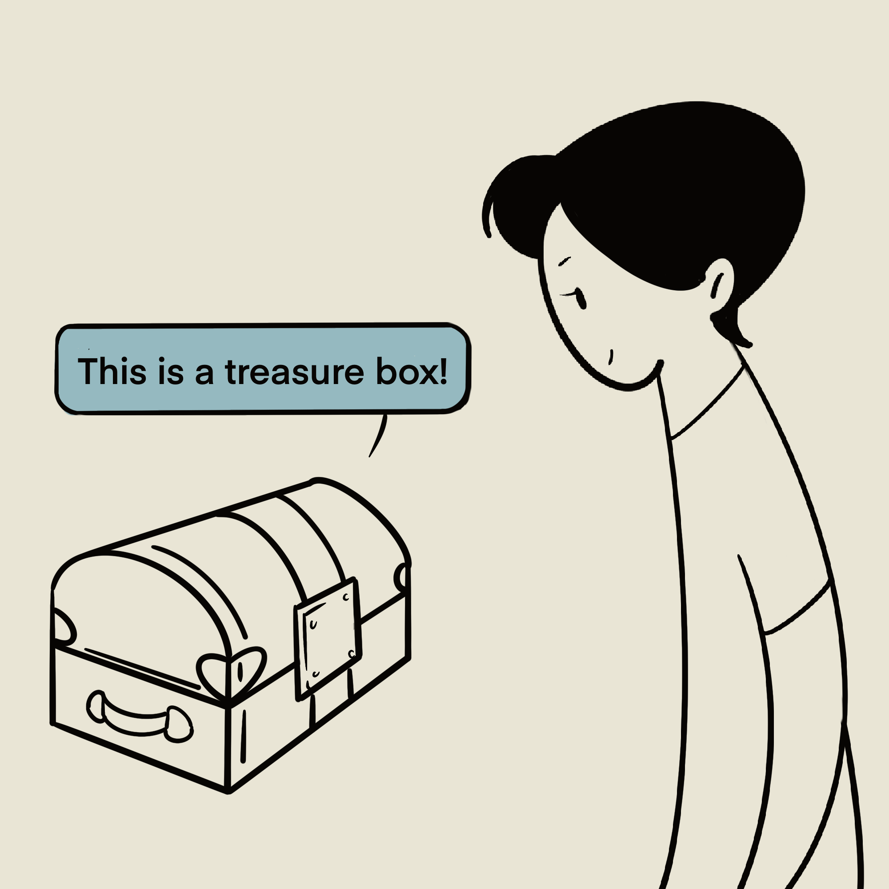
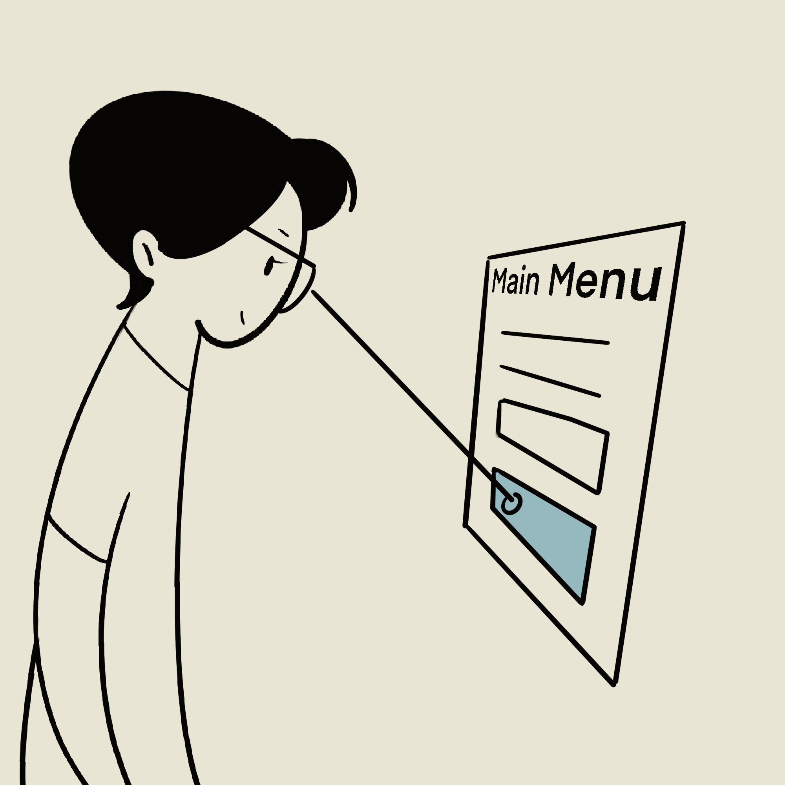
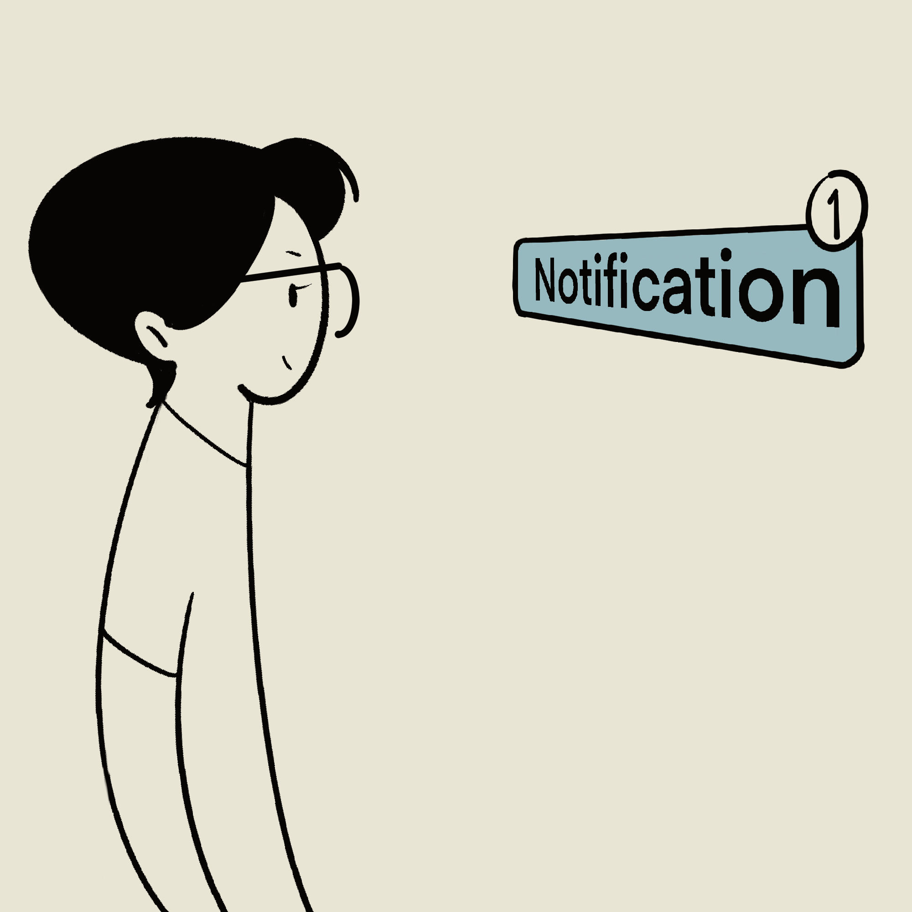
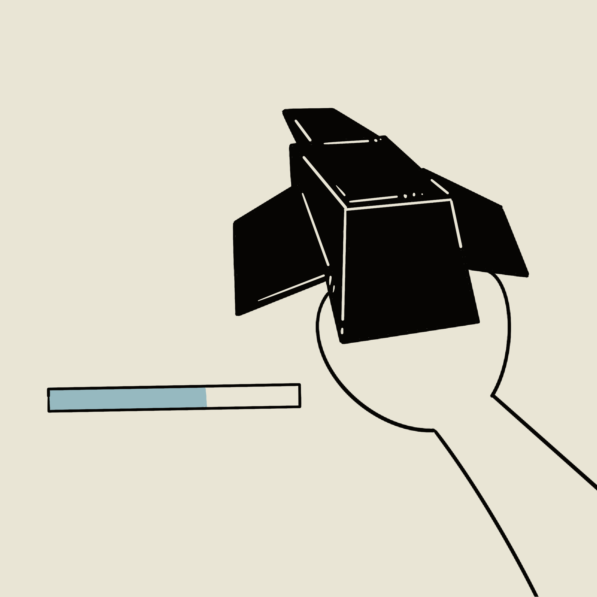
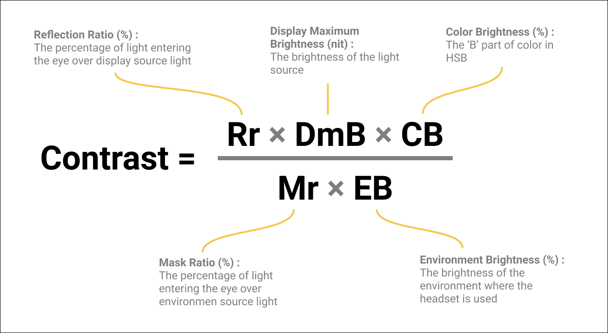
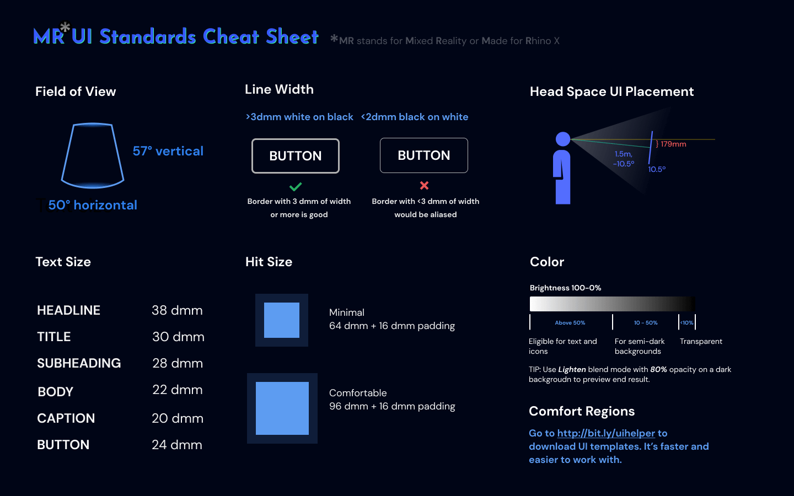
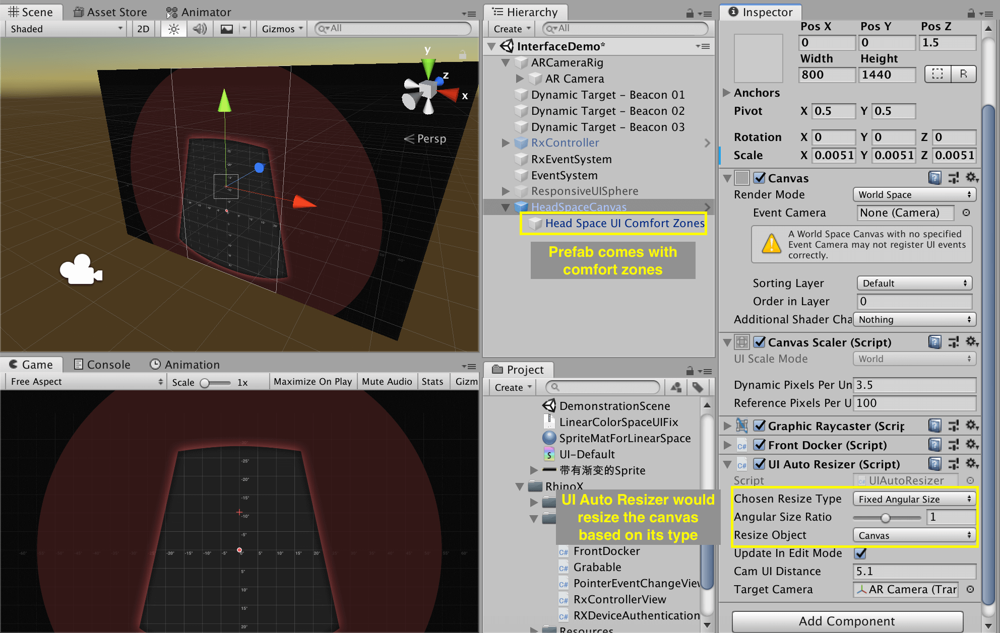
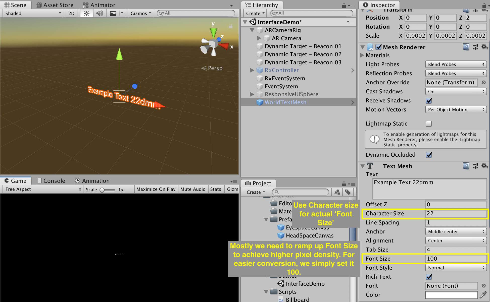

# 用户界面

最佳的UI（用户界面）就是根本没有UI。这对于MR来说尤其正确。MR中的UI应该符合人机工学、不打扰用户，并只在它真正被需要的时候出现。

## UI的类型

MR中，我们根据UI所处的位置将UI划分为世界空间、头部空间、眼部空间和手柄空间。之所以这么分，是因为不同空间的UI有着截然不同的适用范围和人机要求。

|  世界空间   | 头部空间  | 眼部空间 | 手柄空间 |
|  ----  | ----  | ----  | ----  |
|     |    |   |   |
| 锚定在世界坐标的UI。很适合显示与世界中物体相关的信息。通常不会打扰用户但如果没有精心放置的话用户可能会察觉不到。| 位置锚定在头部，但用户可以旋转查看UI的不同区域。结合延迟跟随（tag-along），用户一定能够察觉到这种UI。建议仅用它来显示必要的信息，且不要常显。此类UI需要遵循较严格的人机要求。| 固定在眼部空间。用户无法旋转头部来查看UI的不同区域因为UI与眼睛的相对位置是固定的。因此这类UI只能用于显示重要、简短的通知类信息，且不能常显。| 锚定在手柄空间的UI。当用户抬起手就能看到。很适合用于显示一个工具面板或是子弹计数器。

## 人机工程学

UI的人机工程学是基础性的原则。它是一个可用的UI的底线。

### 前人的工作
这些年对于空间UI的大小和距离已经有了不少研究和规范的产出。

三星研究院的Alex Chu研究了[头部旋转的舒适度范围和UI在不同距离的舒适度](https://www.youtube.com/XjnHr_6WSqo)。

<!-- Mike Alger further developed it into zones for content placement and interaction area. He also cited data from [*Visual Ergonomics in the Office*](https://docplayer.net/20715044-Visual-ergonomics-in-the-office.html).

<iframe width="100%" height="400" src="https://www.youtube.com/embed/id86HeV-Vb8" frameborder="0" allow="accelerometer; autoplay; encrypted-media; gyroscope; picture-in-picture" allowfullscreen></iframe> -->
谷歌发明了 `dmm` 来更好地描述空间中的尺度（视频见下）。我们觉得这是个很好的想法，也在项目中进行了应用。他们也为文字的尺寸（1.375°或约 24 dmm）和按钮的尺寸（64 dmm）制定了标准。注意这些标准是针对诸如Oculus Rift CV和HTC Vive这样的本世代的VR头显，而不是针对HoloLens 和Magic Leap One这样的高角分辨率AR头显。

<iframe width="100%" height="300" src="https://www.youtube.com/embed/ES9jArHRFHQ?start=492" frameborder="0" allow="accelerometer; autoplay; encrypted-media; gyroscope; picture-in-picture" allowfullscreen></iframe>

现在的VR和MR头显的规格比较碎片化。每个设备都有其特有的视场角、光学特性和角分辨率（[视场角](http://doc-ok.org/?p=1414)和[角分辨率](https://twitter.com/PalmerLuckey/status/756243796275310593)甚至还没有一个通用的计算标准）。对于[HoloLens](https://docs.microsoft.com/zh-cn/windows/mixed-reality/text-in-unity#the-minimum-legible-font-size) ，官方推荐的最小文字尺寸约为0.4° 或 7 dmm。对于[Magic Leap One](https://developer.magicleap.com/learn/guides/design-typography)，官方推荐的最小文字尺寸为8 dmm。对于Rhino X，我们推荐的最小文字尺寸为22 dmm。

### 我们的工作

#### 色彩标准
在一个光学穿透MR系统中，光只能添加到视野里而黑色物体就是透明的。就像在Photoshop中使用`减淡`的图层混合模式一样。

在PC或移动端，已经有诸如[AAA对比度值](https://usecontrast.com/guide)的色彩对比度标准。在MR领域，创立这样的标准要困难得多，因为光学、显示亮度、环境亮度都会对实际人眼感受到的显示内容的对比度有很大影响。 (注意色调和饱和度几乎不会影响可读性).

在我们针对室内环境的基于Rhino X的用户测试中，我们发现：低于10%亮度的颜色基本为透明；在10%到50%亮度之间的颜色可以被感知，但不应用于文字这类需要高对比度的元素（除非放在一个亮色背景上）；高于50%亮度的颜色的对比度则是足够的。

为MR的UI设计多乐，你脑海中的调色盘就会变成像下面这样：

#### 线宽标准

与现在的手机视网膜屏幕相比，现在很多的XR头显的角分辨率都偏低。因此，如果一条线过细，它会在视野中显得锯齿感很强（除非开极高的抗锯齿，但移动端往往无法支持）。设计师应在选择字体和描绘线条时注意这一点。

我们的用户测试显示，即使使用4x的抗锯齿，宽度低于3dmm的白色线条也会显得锯齿感很强，而宽度低于2mm的黑色线条（在白色背景之上）会显得锯齿感很强。同时，注意为所有UI元素边缘添加一个像素的出血间隔。如果没有的话，游戏引擎往往会将其渲染成为mesh的边界，其锯齿感会更加严重。

#### 眼部空间UI标准
在[UI类型]()一节中，我们提到了眼部空间UI。它用于显示一些用户当前**必须**要看到的信息，例如一条重要的通知或是点击音量加减按钮后的反馈UI。这些UI一般固定在头部空间，不受头部旋转和移动的影响。设计师对于头部空间UI应该多加小心。

##### 规则
1. 仅用于显示当前必要的信息
2. 将其放在一个舒适的位置（[见下]()）

##### 类型
| 类型 |  非阻断式              | 阻断式  |
| ---- | ----------         | --- |
| 用法 | 简短的，不会打断当前操作的通知类信息（类似于移动端的toast）  | 会打断当前操作的信息，如游戏结束的提示语  |

##### 舒适区域
以下的舒适区域划分是通过用户测试得出的，针对Rhino X：

### Rhino X 标准总览

如果你为Rhino X开发，请查看我们的[MR UI Figma 模板](https://www.figma.com/file/i9Az94FXnHDCRw09Wlz5lM/daydream_stickersheet_components_20170517?node-id=76%3A380) 和 [MRUIHelper.unitypackage](https://drive.google.com/file/d/1CxGVXWRHYkHK2gpme-HViuTdVp9NZJ5N/view?usp=sharing) 来开始你的设计. Unitypackage内也包含必要的脚本，例如`billboarding`, `auto resize`, `UI docker`等。

下面就是MRUI Figma 模板的预览（可能需要科学上网）：

<iframe style="border: none;" width="100%" height="450" src="https://www.figma.com/embed?embed_host=share&url=https%3A%2F%2Fwww.figma.com%2Ffile%2Fi9Az94FXnHDCRw09Wlz5lM%2Fdaydream_stickersheet_components_20170517%3Fnode-id%3D0%253A1" allowfullscreen></iframe>

### 如何与工程对接
1. 使用我们的模板在Sketch、Figma或其他矢量设计软件内设计

	在设计时留意我们提供的颜色和线宽等标准。

2. 将图片导出（导出是选择1x还是2x，在模板里面已经有说明）

!> **NOTE** 注意导出时需要留出一个像素的边框，否则，游戏引擎往往会将边框渲染成mesh的边界，锯齿感更强。

3. 将`MRUIHelper.unitypackage`导入到Unity工程里

4. 如果是类似于主菜单这样的头部空间UI，将`HeadCanvas.prefab` 拖进场景中。这个prefab里包含了不同舒适区域，方便你摆放UI。

?> _TIP_ 当插入sprite时，只需要点击`Set Native Size` 按钮就可以设置为sprite设置正确的宽高，无需手动调节且能一比一还原设计稿。

5. 对于简单的、不需要canvas的UI，比如一个世界空间的标注，将 `WorldSprite.prefab`、`WorldTextMesh.prefab`或`WorldTextMeshPro.prefab` 拖入场景即可。

?> _TIP_ 当使用`WorldTextMesh.prefab`是，请通过改变character size的方式来更改font size，并保持character size在100。这么做是为了简化换算并确保文字清晰可读。

6. 对于眼部空间UI canvas，将`EyeCanvas.prefab` 拖入场景即可。

<!-- ## Responsive MR UI
### Billboarding and tag along
[Billboarding](https://docs.microsoft.com/en-us/windows/mixed-reality/billboarding-and-tag-along#what-is-billboarding) makes UI face you all the time. Billboarding might break your composition since user's position is uncertain. You can use the gizmos helper to check for unwanted clipping or occlusion.

[Tag long](https://docs.microsoft.com/en-us/windows/mixed-reality/billboarding-and-tag-along#what-is-a-tag-along) adds a small delay to the head space UI for comfort. `Billboard.cs` and `TagAlong.cs` are avaliable in `UIHelper.unitypackage`.

### Responsive size

When a world space UI is related to an object, we recommend to use 	the following responsive size pattern to ensure eligibility without breaking composition.  `WorldSpriteWithText.prefab` in `UIHelper.unitypackage` comes with this by default.

|               | Far away  |   Mid range     | Close up  |
| ----------         | ---      |  ----------         | ---      |
| Distance  | >5m    |  1 to 5m | <1m |
| Style  |  Hide or show a dot    | Constant angular size    | Constant actual size and fade away when <30cm |
| Video  |     |     |  |
 -->

<!-- ## Others

### Linear color space problem of Unity
Transparent UI won't render properly when [linear color space is checked in Unity](https://cmwdexint.com/2019/05/30/3d-scene-need-linear-but-ui-need-gamma/). Use the shader in `LinearCorlorSpaceUIFix.unitypackage` to fix it.

 -->

## 面向未来：超越WIMP(Window-Icon-Menu_Pointer) 
本页介绍的UI还是运用传统意义上的WIMP隐约，只不过交互方式变为了偷瞄或ray-cast。WIMP在MR中依然会很重要，因为MR应用里依然存在很多`抽象概念模型`，这些是最适合用WIMP来设计UI。但正如触摸手势为移动平台添加了新的一个维度，MR平台也有着巨大的UI方面的创新机会。以下介绍的创新机会有的能提高可用性，而有的能让UI用起来更加愉悦。

### 空间手势
三维UI最让人兴奋的领域之一就是空间手势。拖拽、滑动、双指缩放等都是目前通用的手势交互，而它们兼顾了有用和愉悦。在XR领域，双手缩放和抛开删除就是两个正在成为标准的手势。

### 空间控件
一些VR游戏几乎没有使用任何的GUI（图像用户界面）。它们设计了创新的空间控件来完成相应任务。将代表游戏关卡的卡带放入卡槽这一交互就已经被多个VR游戏采用，几乎成为了新的标准。不过这些新的创新控件不一定效率更高或更加容易理解，设计师设计时需要反复测试。

### 复制现实世界的工具
对于那些在现实世界中有对标的应用，如白板应用，设计师几乎可以消除所有的GUI，而直接复制现实生活中的体验即可（如真实的笔、橡皮擦和白板）。

### Z轴
在传统的2D平面上是不存在Z轴，即深度这个轴的。Z轴可以提高显示容量。而我们的大脑在记忆空间关系方面特别擅长，比记忆抽象概念擅长得多（这也是为什么有的记忆方法会通过虚拟一个宫殿来增强记忆）。谷歌Daydream实验室的一个[从一叠图片中选取照片的例子](https://youtu.be/lGUmTQgbiAY?t=488)就展现了Z轴提高显示容量的潜力：
<video width="100%" autoplay loop muted  src="videos/Daydream_Labs_Selecting%20photos.mp4"></video>

### 三维化
简单讲每一个UI元素变成三维的对增强可读性和可识别性没有任何帮助，但是能带来特别的艺术风格。对于游戏来说，符合游戏设定的、合理的三维化UI能增强沉浸感，例如《[地铁](https://medium.com/@thewanderlust/considering-the-narrative-in-user-interface-design-for-video-games-c45953c22760)》游戏系列。
目前，创建三维UI元素需要比二维UI花的时间多得多，因为三维UI的工具链还远远没有成熟。我们暂时只能用三维建模软件（如3DsMAX、Blender）来实现许多三维UI。

### 材质
UI设计一直都在运用颜色、高光、阴影来建立合理的视觉层级关系。在MR中，UI本身就在一个三维渲染引擎里，因此设计师可以有更多机会来充分利用引擎强大的三维渲染能力来渲染不同的材质，以创造一个独特的视觉风格。

