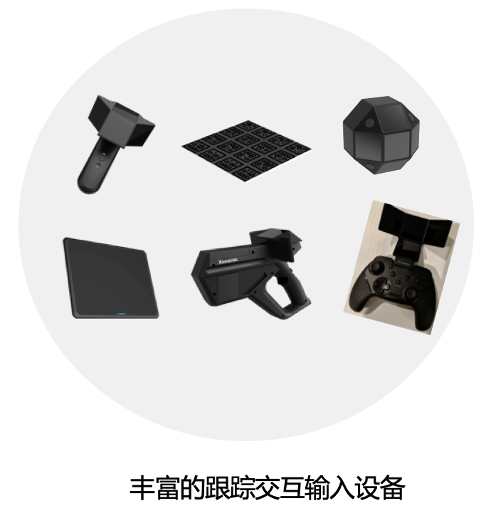
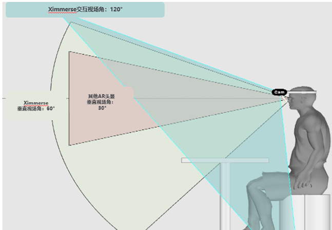
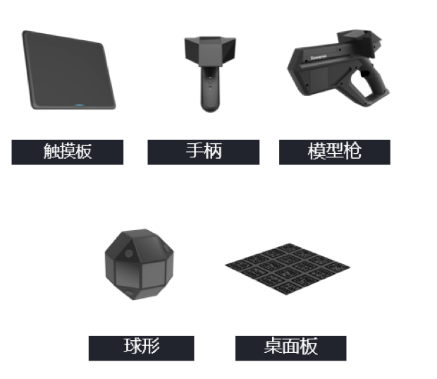
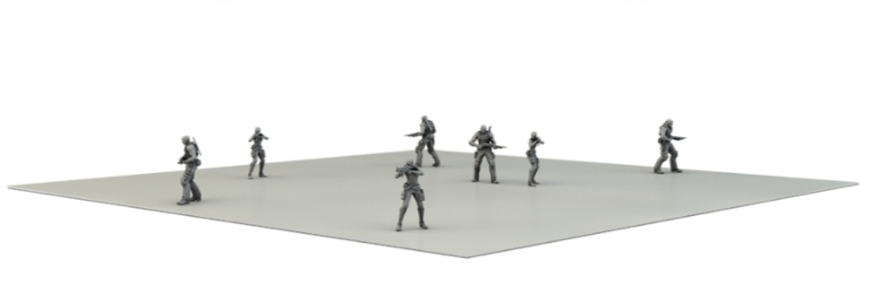
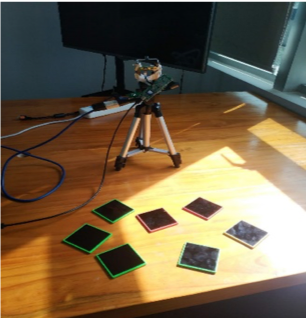
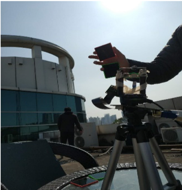
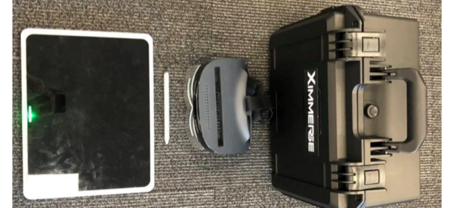
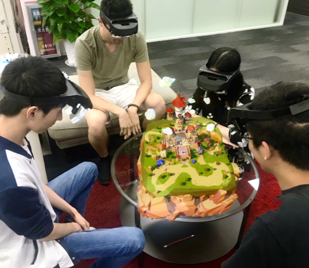

# About Rhino-X  :id=docs-README

> Ximmerse Rhino-X is an augmented reality headset. This documentation will guide developers from the simple setup process to advanced usage of Rhino-X.

Rhino-X uses free-form surface optics for rendering, Visual Inertial Odometry (VIO) for motion tracking, and Tag based recognition for object tracking.

The system is capable of providing a large Field of View (FOV), enabling effective, efficient, flexible and stable interactions with holograms.

The system is ideal for applications in the education, medical, vocational training, and entertainment industries.

# System Introduction
## HMD and Controller Devices
> RhinoX is an augmented reality system that enables rich 3D interactions with a headset and customizable controller devices.
>

## Wide FOV
> RhinoX is an augmented reality device that utilizes **free-form reflective lens** technology. The lens can be attached **magnetically** to the HMD. The system utilizes **Ximmerse's custom anti-distortion algorithm**, stereoscopic rendering, Asynchronous TimeWarp to provide **low latency**, **high stability**, **high resolution**, **wide FOV** rendering.

## World Space Anchor
> RhinoX uses Qualcomm's **Snapdragon 835 SLAM Tracking** to provide 6DoF tracking. **Ximmerse X-Tag interaction system** enables rich interactions with virtual elements.

Anchors can be used to define virtual interaction spaces that map accurately to the physical world. They also enable applications where multiple users in a physical location must share the same virtual world.

 

## Input Devices

## Multiplayer Support

## Stable Tracking
> The X-Tag interaction system enables 6DoF marker tracking with a single camera. The system is low-cost, easily maintainable, reliable and flexible; covering a large range of location and operational conditions.

Developers can design different interactive applications that meet their unique needs using custom marker placements.

 
 
 

## Portable

## Applications
> RhinoX AR system can be used in a lot of industries, such as medical, education, vocational training and entertainment.

## Medical Industry

## Education Industry

## Manufacture Industry

## Entertainment Industry

